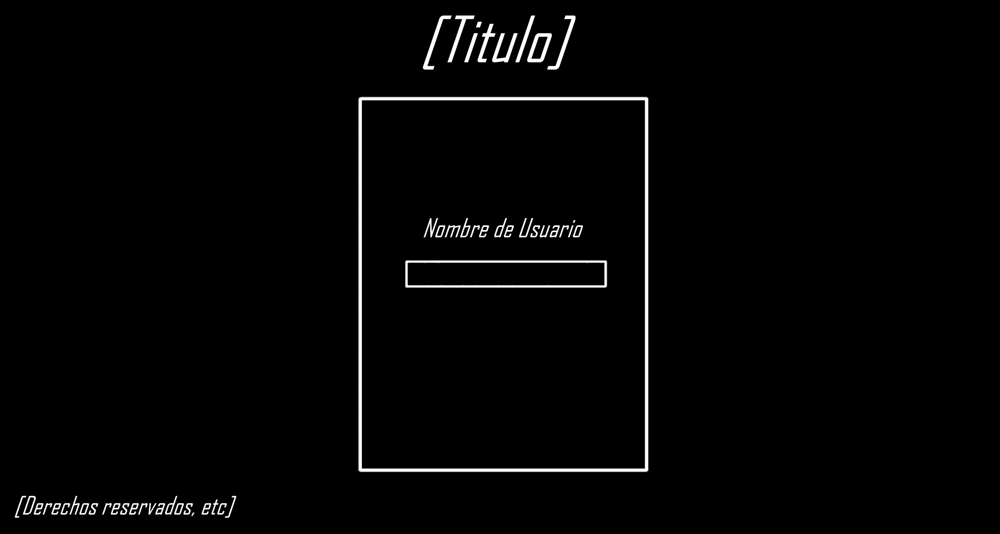
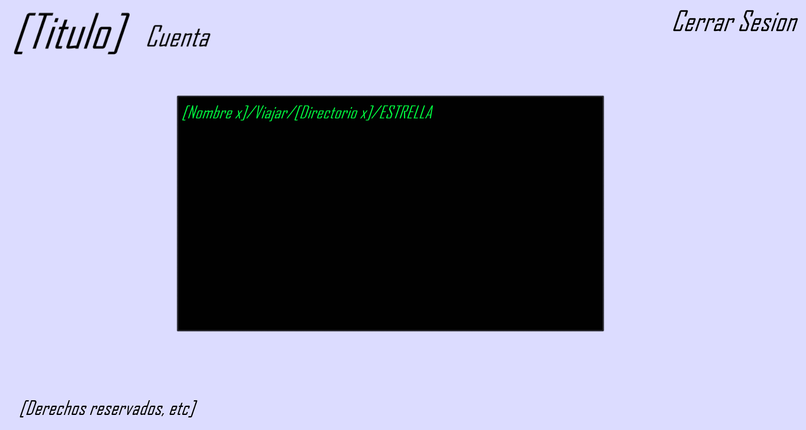

# DisTerminal

"No todos los héroes empuñan espadas. Algunos escriben comandos en una terminal."

## ¿Qué es DisTerminal? 

[DisTerminal] es un prototipo de videojuego web desarrollado con ASP.NET Core MVC, Razor Pages, Entity Framework Core y SQLite, donde el jugador debe localizar una misteriosa ⭐ ESTRELLA escondida dentro de un sistema de directorios virtual.

## La premisa es sencilla: 

1. Ingresa un nombre de usuario.

2. Explora directorios utilizando comandos.

3. Encuentra el directorio donde se oculta la Estrella.

4. Reclama tu victoria.

5. Intenta superar tu mejor tiempo. 

---

## Jugar ahora

Versión Online

Enlace al prototipo:

Visita aqui 👉 [DisTerminal](https://disterminal-juego-prototipo-production.up.railway.app) para jugar.

---

## Historia

Los sistemas de almacenamiento galácticos han sufrido una anomalía.
Una antigua entidad conocida como La Estrella ha sido ocultada dentro de una red de directorios digitales.
Miles de exploradores han intentado encontrarla.
Pocos lo han logrado.
Tu misión es navegar por los directorios permitidos y descubrir dónde se encuentra antes que nadie.

---

## Cómo jugar

1. Crear sesión

Al ingresar al juego deberás introducir un nombre de usuario unico.

Ejemplo:

```
CapitanClark
```

---

2. Explorar directorios

El juego utiliza una sintaxis específica para moverse.

Formato:

```
Usuario/Viajar/[Directorio]
```

Ejemplo:

```
CapitanClark/Viajar/Img
```

---

3. Directorios disponibles

Actualmente existen cinco ubicaciones posibles:

```
Docs

Img

Pdf

Gif

Vid
```

La Estrella se esconde aleatoriamente en una de ellas al comenzar cada partida.

---

4. Encontrar la Estrella

Cuando descubras el directorio correcto recibirás una señal.

Luego deberás ejecutar:

```
CapitanClark/Viajar/ESTRELLA
```

## Si lo haces correctamente:

✅ Victoria

✅ Registro de tiempo

✅ Nuevo escondite generado automáticamente

---

## ⚠️ Sintaxis válida

Correcto:

```
Usuario/Viajar/Docs

Usuario/Viajar/Img

Usuario/Viajar/Pdf

Usuario/Viajar/Gif

Usuario/Viajar/Vid

Usuario/Viajar/ESTRELLA
```

Incorrecto:

```
Viajar/Docs

Usuario/Docs

Usuario/Buscar/Docs
```

---

## Sistema de récords

Cada vez que un jugador encuentra la Estrella se registra: 

- Nombre del jugador

- Tiempo empleado

- Fecha de la partida

- Resultado obtenido

Posteriormente los registros pueden consultarse desde el historial.

---

## Usuario Administrador

Existe un usuario especial:

```
admin963
```

Este usuario posee privilegios administrativos para la gestión global de registros.

---

## Estructura del proyecto (lo mas importante)

```
pryLPWeb\DisTerminal

│
├── Controllers
│   ├── HomeController
│   ├── JuegoController
│   └── HistorialController
│
├── Models
│   ├── Jugador
│   ├── RegistroTiempo
│   └── MecanicaJuego
│
├── Data
│   └── TerminalDbContext
│
├── Views
│
├── wwwroot
│
├── Migrations
│
└── TerminalDB.db
```

---

## Tecnologías utilizadas

### Backend

- ASP.NET Core 8

- C#

- MVC

- Entity Framework Core

### Base de datos

- SQLite

### Frontend

- Razor Views

- HTML5

- CSS3

- JavaScript

### Hosting

- Railway

- GitHub

---

## Mecánica interna

La lógica principal se encuentra en:

```
MecanicaJuego
```

La clase:

- Genera una ubicación aleatoria para la Estrella.

- Valida la sintaxis de los comandos.

- Gestiona los directorios permitidos.

La Estrella puede aparecer en:

```
Docs

Img

Pdf

Gif

Vid
```

---

## Base de datos

### Jugadores

| Campo | Tipo |
|---------|---------|
| Id | int |
| NombreUsuario | string |
| FechaRegistro | DateTime |

### RegistrosTiempos

| Campo | Tipo |
|---------|---------|
| Id | int |
| JugadorId | int |
| TiempoJugado | TimeSpan |
| FechaPartida | DateTime |
| EncontroEstrella | bool |

---

## Características implementadas

- Registro automático de jugadores.

- Persistencia mediante SQLite.

- Sistema de búsqueda de directorios.

- Cronómetro de partida.

- Historial de tiempos.

- Clasificación por velocidad.

- Gestión administrativa.

- Cookies para mantener la sesión activa.

- Generación aleatoria de objetivos.

---

## Posibles mejoras futuras

- Mas directorios y subcarpetas falsos.

- Sistema de puntuación.

- Ranking global.

- Easter Eggs.

- Actualizaciones de temas visuales.

- Sonidos ambiente retro de terminal.

- Múltiples niveles.

---

## Capturas de los conceptos/borradores

### Pantalla de Inicio

<p align="center">
  
</p>

### Terminal de Juego

<p align="center">
  
</p>

---

## Instalación local

Clonar repositorio:

```
git clone https://github.com/AS23T/DisTerminal-Juego-Prototipo.git
```

Restaurar dependencias:

```
dotnet restore
```

Aplicar migraciones:

```
dotnet ef database update
```

Ejecutar:

```
dotnet run
```

---

## Objetivo académico

Este proyecto fue desarrollado como práctica de:

- Programación Web

- Arquitectura MVC

- Entity Framework Core

- Persistencia de datos

- Diseño de mecánicas simples de videojuego

- Despliegue de aplicaciones ASP.NET Core

---

## Reflexión final

DisTerminal demuestra que no hacen falta gráficos hiperrealistas ni motores de última generación para crear una experiencia interactiva.
A veces basta con mecanicas simples pero divertidas.

---

### Buena suerte, CapitanClark.

```
[Usuario]/Viajar/ESTRELLA
```

# ⭐
